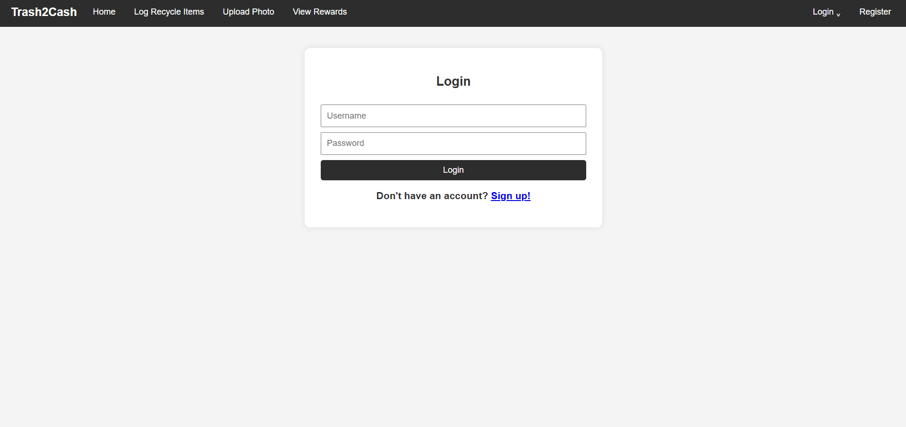
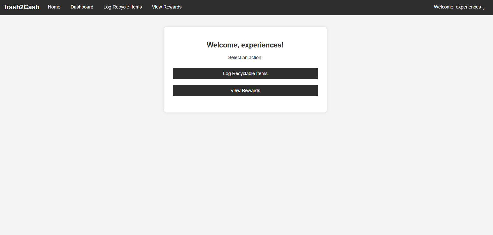

#  Waste Recycling Incentive Web Application

A full-stack web application designed to encourage recycling through an incentive-based rewards system, supporting waste management initiatives in Johannesburg.

## Screenshots
<!-- Add screenshots here -->




## What This Project Is
This project was developed as part of a synoptic assessment to address real-world challenges around illegal dumping and low recycling engagement.
The application allows users to log recyclable waste, earn points, and redeem rewards, while administrators can manage users, rewards, and recycing data.

## Key Features
- User registration and authentication
- Waste logging system with point allocation
- Rewards and incentive tracking
- Admin dashboard for managing users and rewards
- Server-side rendered UI using EJS
- MVC-based backend architecture

## 🛠️ Tech Stack
- **Node.js** & **Express.js** – backend logic and routing
- **MongoDB** & **Mongoose** – database and data models
- **EJS** – server-side rendering
- **HTML / CSS** – frontend structure and styling
- **Git & GitHub** – version control

## ▶️ Run Locally
```bash
git clone https://github.com/your-username/your-repo-name.git
cd your-repo-name
npm install
npm start
